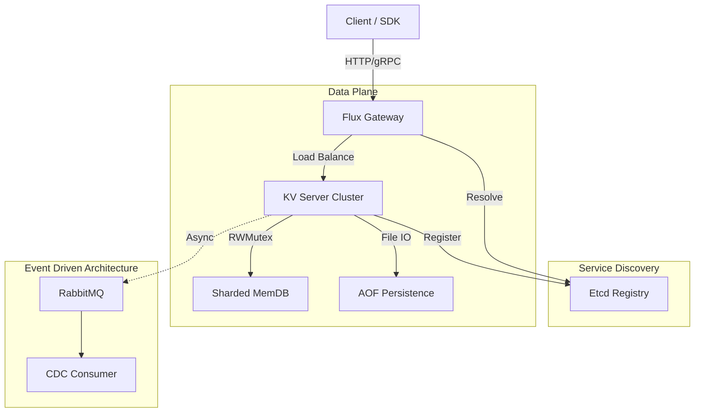
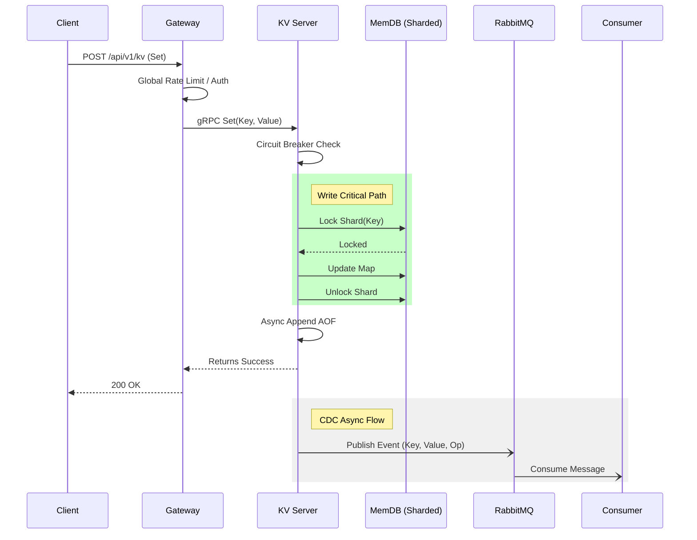

# Flux-KV (基于 Go 的高并发分布式键值存储系统)

这是一个高性能的分布式 KV 存储系统与微服务网关项目，集成了 Go 语言核心特性与云原生技术栈。

本项目旨在构建一个高并发、强一致性、工业级的分布式 KV 存储与网关系统。

## 🚀 功能特性

### 🏗️ 系统架构



### 🛣️ 核心写流程 (Set Sequence)



### 分布式 KV 存储
- **高性能存储**: 
  - [x] 基于 sync.RWMutex 的基础存储
  - [x] **分片锁 (Sharded Map) 优化**: 降低高并发写冲突
- **事件驱动架构**:
  - [x] **CDC (Change Data Capture)**: 实时数据变更流
  - [x] **RabbitMQ 集成**: 异步解耦与削峰填谷
- **持久化**: 支持 AOF (Append Only File) 持久化与启动恢复。
- **过期机制**: 实现 Lazy + Active 混合过期清理策略。
- **通信协议**: 自定义 TCP 协议（解决粘包问题）与 gRPC 接口支持。
- **一致性**: 一致性哈希算法实现数据分片。

### 微服务网关
- **服务发现**: 集成 Etcd 实现动态服务注册与发现。
- **动态代理**: HTTP 转 gRPC 泛化调用。
- **高可用**: 
  - 全局限流 (Token Bucket)
  - 熔断降级 (Hystrix)
  - 负载均衡 (RoundRobin)
  - 防缓存击穿 (SingleFlight)
- **工程化**:
  - [x] 优雅启停 (Graceful Shutdown)
  - [x] Docker Compose 全栈容器化编排
- **可观测性**: 集成 OpenTelemetry/Jaeger 链路追踪与 Prometheus 指标监控。

## 🛠️ 快速开始

### 前置条件
- Go 1.22+
- Etcd (用于服务发现)
- Jaeger (可选，用于链路追踪)

### 运行服务端 (KV Server)
```bash
go run cmd/server/main.go
```

### 运行网关 (Gateway)
```bash
go run cmd/gateway/main.go
```

### 运行客户端测试
```bash
go run cmd/client/main.go
```

## 🐳 Docker 快速部署 (推荐)

本项目支持 Docker Compose 一键拉起完整环境 (Etcd + RabbitMQ + Jaeger + KV Nodes + Gateway)。
详细的操作指南、集群扩容和运维命令请参考 [Docker 部署手册](docs/DOCKER.md)。

### 1. 构建并启动集群
```bash
docker-compose up --build -d
```

### 2. 查看节点状态
```bash
docker-compose ps
```

### 3. 操作验证
```bash
# 写入数据 (HTTP -> Gateway -> KV Node)
curl -X POST -d "key=hello&value=world" http://localhost:8080/api/v1/kv

# 验证 CDC 异步日志
docker logs -f flux-cdc-consumer
```

### 4. 访问管理后台
- **Jaeger UI**: http://localhost:16686
- **RabbitMQ**: http://localhost:15672 (User: fluxadmin / Pass: flux2026secure)

## 📊 性能表现

我们针对系统的核心组件进行了严格的基准测试 (Benchmark)，涵盖了写密集型场景、CDC 异步处理影响以及锁竞争分析。

详细的压测数据和分析报告请参阅 [性能测试报告](PERFORMANCE.md)。

## � 接口文档

详细的 API 接口定义、参数说明和错误码请参阅 [API 参考文档](docs/API.md)。

## �📝 目录结构
```
├── api/            # IDL 定义 (Proto/gRPC)
├── cmd/            # 程序入口 (Gateway, Server, Client)
├── configs/        # 配置文件
├── internal/       # 私有业务逻辑
│   ├── core/       #存储引擎核心 (MemDB)
│   ├── gateway/    # 网关核心逻辑
│   ├── protocol/   # 通信协议
│   └── service/    # gRPC 服务实现
├── pkg/            # 公共库 (Client, Logger, Discovery)
├── scripts/        # 测试与运维脚本
└── tools/          # 工具集
```
