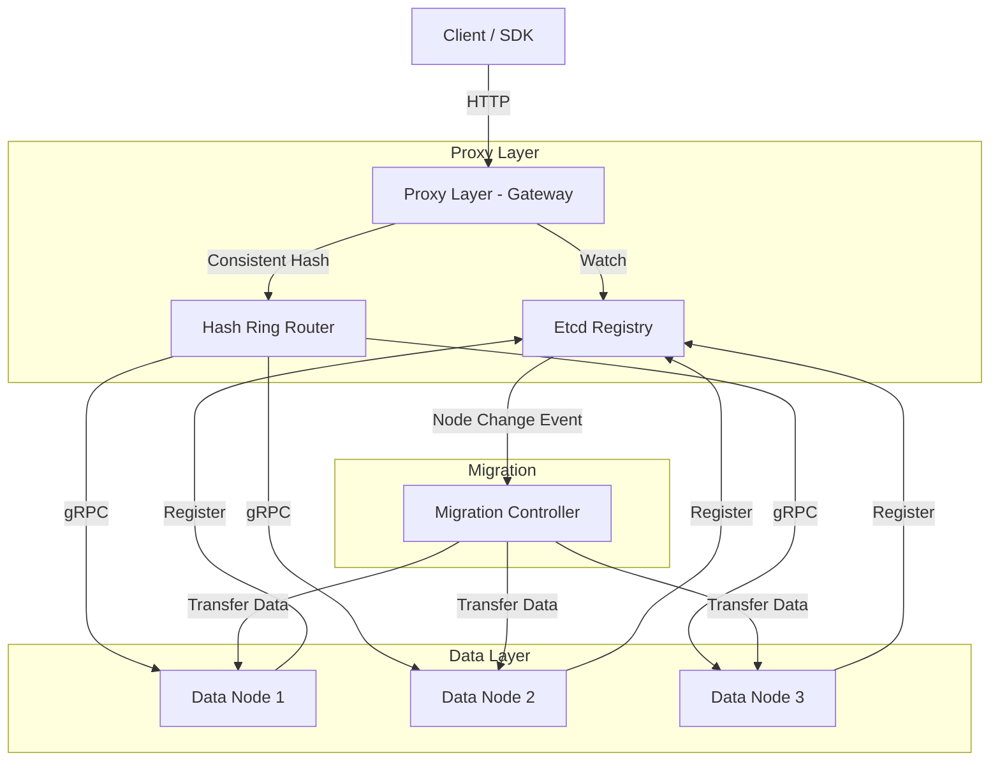
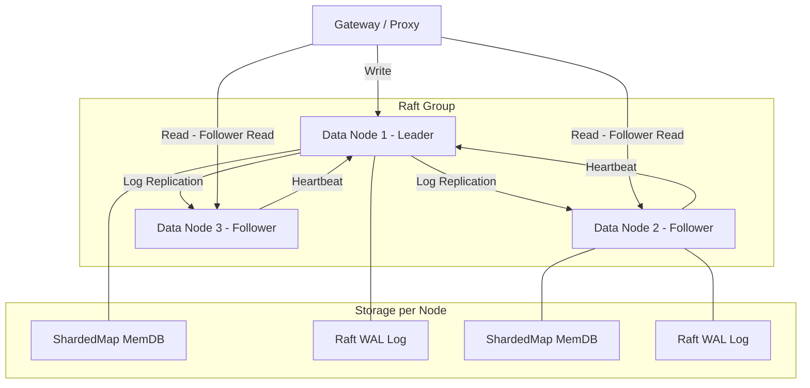
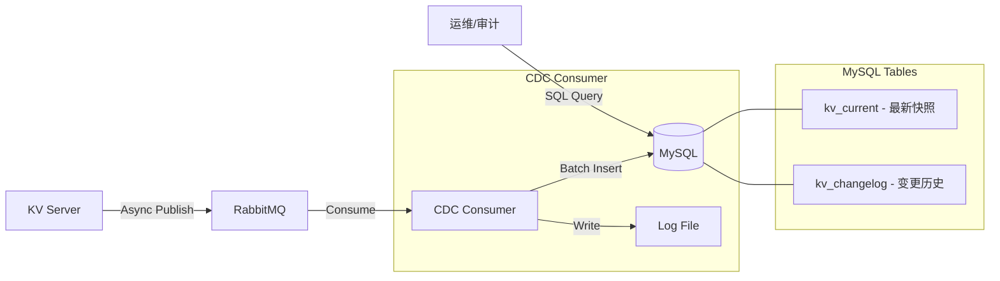

# Flux-KV 架构演进方案

> 本文档包含三个进阶方向的详细代码改造方案。如果时间有限只能做一个，**推荐优先实施方案 C (MySQL 集成)**，原因见文末。

---

## 方案 A：Proxy/Data 节点分离 + 业务无感知扩缩容

### 现状分析

当前 Gateway 虽然承担了 HTTP→gRPC 转发的角色，但路由逻辑分散：
- `cmd/benchmark/main.go` 中自行维护一致性哈希环
- `cmd/client/main.go` 中也独立维护哈希环
- Gateway 通过 gRPC Client 的 RoundRobin 做负载均衡，没有按 Key 路由

**核心问题**：当 Data Node 扩缩容时，各客户端的哈希环不一致，且没有数据迁移机制。

### 目标架构



### 文件变更列表

| 操作 | 文件路径 | 说明 |
|------|---------|------|
| 新增 | `internal/proxy/router.go` | 统一路由层，封装一致性哈希 + 节点连接池 |
| 新增 | `internal/proxy/migration.go` | 数据迁移控制器 |
| 新增 | `api/proto/migration.proto` | 数据迁移 gRPC 接口定义 |
| 修改 | `internal/gateway/handler/kv.go` | 使用 Proxy Router 替代直连 |
| 修改 | `internal/service/handler.go` | 新增 Scan/BatchGet 接口供迁移使用 |
| 修改 | `pkg/consistent/consistent.go` | 新增 GetNodesForRange 方法 |
| 删除 | `cmd/benchmark` 和 `cmd/client` 中的哈希环逻辑 | 统一由 Proxy 处理路由 |

### 核心接口设计

```go
// internal/proxy/router.go
package proxy

import (
    "Flux-KV/pkg/consistent"
    "Flux-KV/pkg/discovery"
    "google.golang.org/grpc"
    "sync"
)

// Router 统一路由层，所有 Key 路由逻辑收敛到这里
type Router struct {
    hashRing *consistent.Map
    conns    map[string]*grpc.ClientConn // addr -> gRPC 连接池
    mu       sync.RWMutex
    registry *discovery.EtcdRegistry
}

// NewRouter 初始化路由器并 Watch Etcd 节点变化
func NewRouter(registry *discovery.EtcdRegistry) (*Router, error) {
    r := &Router{
        hashRing: consistent.New(150, nil),
        conns:    make(map[string]*grpc.ClientConn),
        registry: registry,
    }
    // 启动 Watch 监听节点上下线
    go r.watchNodes()
    return r, nil
}

// Route 根据 Key 路由到对应的 Data Node 连接
func (r *Router) Route(key string) (*grpc.ClientConn, error) {
    r.mu.RLock()
    defer r.mu.RUnlock()
    
    addr := r.hashRing.Get(key)
    conn, ok := r.conns[addr]
    if !ok {
        return nil, fmt.Errorf("no connection for node: %s", addr)
    }
    return conn, nil
}

// watchNodes 监听 Etcd 节点变化，动态更新哈希环
func (r *Router) watchNodes() {
    // 1. Watch Etcd 的 /services/flux-kv/ 前缀
    // 2. 检测到新增节点: hashRing.Add(addr)，建立 gRPC 连接
    // 3. 检测到删除节点: hashRing.Remove(addr)，触发数据迁移
}
```

```go
// internal/proxy/migration.go
package proxy

// MigrationController 负责节点扩缩容时的数据迁移
type MigrationController struct {
    router *Router
}

// OnNodeAdded 新节点加入时，将受影响的 Key 从老节点迁移到新节点
func (mc *MigrationController) OnNodeAdded(newNode string) error {
    // 1. 计算新节点在哈希环上负责的 Key 范围
    // 2. 通过 Scan 接口从老节点批量获取受影响的 Key
    // 3. 通过 BatchSet 接口写入新节点
    // 4. 确认成功后从老节点删除
    return nil
}

// OnNodeRemoved 节点下线时，将其数据迁移到后继节点
func (mc *MigrationController) OnNodeRemoved(removedNode string) error {
    // 依赖 AOF 文件全量扫描 或 提前做快照
    return nil
}
```

```protobuf
// api/proto/migration.proto
syntax = "proto3";
package fluxkv;

service MigrationService {
  // Scan 扫描指定哈希范围内的所有 Key
  rpc Scan(ScanRequest) returns (stream KeyValue);
  // BatchSet 批量写入 Key-Value
  rpc BatchSet(stream KeyValue) returns (BatchSetResponse);
}

message ScanRequest {
  uint32 hash_start = 1;
  uint32 hash_end = 2;
}

message KeyValue {
  string key = 1;
  string value = 2;
}

message BatchSetResponse {
  int32 count = 1;
}
```

### 实现步骤

1. **统一路由层** (1-2 天)：创建 `internal/proxy/router.go`，将哈希环 + 连接管理收敛
2. **改造 Gateway** (0.5 天)：`kv.go` 中使用 Router.Route(key) 替代 RoundRobin
3. **新增 Scan/BatchSet 接口** (1 天)：Data Node 支持按哈希范围扫描数据
4. **迁移控制器** (2 天)：实现 OnNodeAdded/OnNodeRemoved 逻辑
5. **集成测试** (1 天)：模拟节点扩缩容，验证数据完整性

---

## 方案 B：Data Node 使用 Raft 组成 Raft Group

### 现状分析

每个 Data Node 完全独立，数据存储在内存 (ShardedMap) + AOF 文件，没有副本。单点故障即数据丢失。

### 目标架构



### 推荐 Raft 库

**推荐 `hashicorp/raft`**，理由：
- API 更高层，开箱即用，适合中小项目快速集成
- 自带 LogStore、SnapshotStore 等实现
- 社区活跃，文档完善 (Consul、Nomad 都在用)

对比 `etcd/raft`：更底层，需要自己实现网络传输和日志存储，学习成本高，适合有定制需求的大型项目。

### 文件变更列表

| 操作 | 文件路径 | 说明 |
|------|---------|------|
| 新增 | `internal/raft/fsm.go` | 有限状态机，将 raft 日志 Apply 到 MemDB |
| 新增 | `internal/raft/node.go` | Raft 节点初始化与管理 |
| 新增 | `internal/raft/snapshot.go` | 快照实现，序列化 MemDB 数据 |
| 修改 | `internal/service/handler.go` | 写请求走 raft.Apply()，读请求可直接读 MemDB |
| 修改 | `internal/core/mem_db.go` | 新增 Snapshot/Restore 方法 |
| 修改 | `cmd/server/main.go` | 初始化 Raft 节点 |
| 修改 | `configs/config.yaml` | 新增 Raft 相关配置 |
| 新增 | `go.mod` | 添加 `github.com/hashicorp/raft` 依赖 |

### 核心代码框架

```go
// internal/raft/fsm.go
package raft

import (
    "Flux-KV/internal/core"
    "encoding/json"
    "io"
    
    hraft "github.com/hashicorp/raft"
)

// Command 表示一条 Raft 日志命令
type Command struct {
    Op    string `json:"op"`    // "set" 或 "del"
    Key   string `json:"key"`
    Value string `json:"value"`
}

// FSM 实现 hashicorp/raft 的 FSM 接口
// 将 Raft 日志应用到 MemDB
type FSM struct {
    db *core.MemDB
}

func NewFSM(db *core.MemDB) *FSM {
    return &FSM{db: db}
}

// Apply 将 Raft 提交的日志条目应用到状态机 (MemDB)
func (f *FSM) Apply(log *hraft.Log) interface{} {
    var cmd Command
    if err := json.Unmarshal(log.Data, &cmd); err != nil {
        return err
    }
    
    switch cmd.Op {
    case "set":
        f.db.Set(cmd.Key, cmd.Value, 0) // Raft Apply 时不再重复写 AOF
    case "del":
        f.db.Del(cmd.Key)
    }
    return nil
}

// Snapshot 返回用于创建快照的接口
func (f *FSM) Snapshot() (hraft.FSMSnapshot, error) {
    // 遍历 MemDB 所有分片，序列化为 JSON
    data := f.db.Snapshot() // 需要在 MemDB 中新增此方法
    return &snapshot{data: data}, nil
}

// Restore 从快照恢复状态
func (f *FSM) Restore(rc io.ReadCloser) error {
    defer rc.Close()
    return f.db.Restore(rc) // 需要在 MemDB 中新增此方法
}
```

```go
// internal/raft/node.go
package raft

import (
    "fmt"
    "net"
    "path/filepath"
    "time"
    
    hraft "github.com/hashicorp/raft"
    raftboltdb "github.com/hashicorp/raft-boltdb"
)

type RaftConfig struct {
    NodeID   string   // 节点唯一标识
    BindAddr string   // Raft 通信地址 (如 :7000)
    DataDir  string   // 数据存储目录
    Peers    []string // 初始集群节点列表
}

// SetupRaft 初始化 Raft 节点
func SetupRaft(cfg RaftConfig, fsm hraft.FSM) (*hraft.Raft, error) {
    // 1. Raft 配置
    config := hraft.DefaultConfig()
    config.LocalID = hraft.ServerID(cfg.NodeID)
    config.HeartbeatTimeout = 1000 * time.Millisecond
    config.ElectionTimeout = 1000 * time.Millisecond
    
    // 2. 传输层 (TCP)
    addr, _ := net.ResolveTCPAddr("tcp", cfg.BindAddr)
    transport, _ := hraft.NewTCPTransport(cfg.BindAddr, addr, 3, 10*time.Second, nil)
    
    // 3. 日志存储 (BoltDB)
    logStore, _ := raftboltdb.NewBoltStore(filepath.Join(cfg.DataDir, "raft-log.db"))
    stableStore, _ := raftboltdb.NewBoltStore(filepath.Join(cfg.DataDir, "raft-stable.db"))
    
    // 4. 快照存储
    snapshotStore, _ := hraft.NewFileSnapshotStore(cfg.DataDir, 2, nil)
    
    // 5. 创建 Raft 实例
    r, err := hraft.NewRaft(config, fsm, logStore, stableStore, snapshotStore, transport)
    if err != nil {
        return nil, fmt.Errorf("new raft: %w", err)
    }
    
    // 6. Bootstrap 集群 (仅首次启动)
    if len(cfg.Peers) > 0 {
        var servers []hraft.Server
        for _, peer := range cfg.Peers {
            servers = append(servers, hraft.Server{
                ID:      hraft.ServerID(peer),
                Address: hraft.ServerAddress(peer),
            })
        }
        r.BootstrapCluster(hraft.Configuration{Servers: servers})
    }
    
    return r, nil
}
```

```go
// internal/raft/snapshot.go
package raft

import (
    hraft "github.com/hashicorp/raft"
)

type snapshot struct {
    data []byte
}

func (s *snapshot) Persist(sink hraft.SnapshotSink) error {
    _, err := sink.Write(s.data)
    if err != nil {
        sink.Cancel()
        return err
    }
    return sink.Close()
}

func (s *snapshot) Release() {}
```

### 读写流程变化

**写流程 (变化)**：
```
Client → Gateway → Leader Node
  → raft.Apply(Command{Op:"set", Key:k, Value:v})
    → Raft 复制日志到多数 Follower
    → FSM.Apply() 写入 MemDB
  → 返回成功
```

**读流程 (两种模式)**：
1. **强一致读**：读请求也通过 Leader，Leader 确认自己仍是 Leader 后读取
2. **最终一致读 (推荐)**：直接从任意节点的 MemDB 读取，性能更高

### 实现步骤

1. **添加依赖** (0.5 天)：`go get github.com/hashicorp/raft github.com/hashicorp/raft-boltdb`
2. **实现 FSM** (1 天)：创建 `internal/raft/fsm.go`，实现 Apply/Snapshot/Restore
3. **MemDB 扩展** (0.5 天)：新增 `Snapshot()` 和 `Restore()` 方法
4. **Raft 节点初始化** (1 天)：创建 `internal/raft/node.go`
5. **改造 Service Handler** (1 天)：写请求通过 `raft.Apply()`，读请求直读
6. **配置与 Docker Compose** (0.5 天)：多节点编排
7. **集成测试** (1 天)：Leader 选举、写入复制、故障切换验证

---

## 方案 C：引入 MySQL (CDC Consumer 数据归档)

### 现状分析

当前 CDC Consumer (`cmd/cdc_consumer/main.go`) 从 RabbitMQ 消费数据变更事件后，仅写入本地日志文件。没有任何 MySQL 使用。

### 设计思路

CDC Consumer 将数据变更同步写入 MySQL 作为**数据归档/审计层**：
- 不影响主流程性能 (异步解耦，通过 RabbitMQ)
- 提供数据变更历史的持久化查询能力
- 逻辑合理：KV 存储负责高速读写，MySQL 负责归档审计
- 简历上可以自然地引入 MySQL 技能点

### 架构图



### MySQL 表结构设计

```sql
-- 数据变更历史表 (核心审计表)
CREATE TABLE kv_changelog (
    id          BIGINT AUTO_INCREMENT PRIMARY KEY,
    event_type  ENUM('SET', 'DEL') NOT NULL COMMENT '操作类型',
    kv_key      VARCHAR(512) NOT NULL COMMENT 'Key',
    kv_value    TEXT COMMENT 'Value (DEL 时为 NULL)',
    event_time  DATETIME(3) NOT NULL COMMENT '事件发生时间 (来自 RabbitMQ 时间戳)',
    consumed_at DATETIME(3) NOT NULL DEFAULT CURRENT_TIMESTAMP(3) COMMENT '消费写入时间',
    INDEX idx_key (kv_key),
    INDEX idx_event_time (event_time)
) ENGINE=InnoDB DEFAULT CHARSET=utf8mb4 COMMENT='KV 数据变更审计日志';

-- 数据最新快照表 (可选，方便查询当前状态)
CREATE TABLE kv_current (
    kv_key      VARCHAR(512) PRIMARY KEY COMMENT 'Key',
    kv_value    TEXT NOT NULL COMMENT '最新 Value',
    updated_at  DATETIME(3) NOT NULL DEFAULT CURRENT_TIMESTAMP(3) ON UPDATE CURRENT_TIMESTAMP(3) COMMENT '最后更新时间'
) ENGINE=InnoDB DEFAULT CHARSET=utf8mb4 COMMENT='KV 数据最新快照';
```

### 文件变更列表

| 操作 | 文件路径 | 说明 |
|------|---------|------|
| 修改 | `cmd/cdc_consumer/main.go` | 集成 MySQL 写入逻辑 |
| 新增 | `internal/storage/mysql.go` | MySQL 连接管理与数据写入 |
| 新增 | `scripts/init_mysql.sql` | 建表 SQL 脚本 |
| 修改 | `configs/config.yaml` | 新增 MySQL 配置项 |
| 修改 | `docker-compose.yml` | 新增 MySQL 服务 |
| 修改 | `go.mod` | 添加 MySQL 驱动依赖 |

### 核心代码框架

```go
// internal/storage/mysql.go
package storage

import (
    "database/sql"
    "fmt"
    "time"
    
    _ "github.com/go-sql-driver/mysql"
)

type MySQLConfig struct {
    Host     string
    Port     int
    User     string
    Password string
    Database string
}

type MySQLStore struct {
    db *sql.DB
    
    // 预编译语句，提高性能
    insertChangelogStmt *sql.Stmt
    upsertCurrentStmt   *sql.Stmt
    deleteCurrentStmt   *sql.Stmt
}

func NewMySQLStore(cfg MySQLConfig) (*MySQLStore, error) {
    dsn := fmt.Sprintf("%s:%s@tcp(%s:%d)/%s?charset=utf8mb4&parseTime=true&loc=Local",
        cfg.User, cfg.Password, cfg.Host, cfg.Port, cfg.Database)
    
    db, err := sql.Open("mysql", dsn)
    if err != nil {
        return nil, fmt.Errorf("open mysql: %w", err)
    }
    
    // 连接池配置
    db.SetMaxOpenConns(10)
    db.SetMaxIdleConns(5)
    db.SetConnMaxLifetime(5 * time.Minute)
    
    if err := db.Ping(); err != nil {
        return nil, fmt.Errorf("ping mysql: %w", err)
    }
    
    store := &MySQLStore{db: db}
    
    // 预编译 SQL
    store.insertChangelogStmt, _ = db.Prepare(
        `INSERT INTO kv_changelog (event_type, kv_key, kv_value, event_time) VALUES (?, ?, ?, ?)`)
    store.upsertCurrentStmt, _ = db.Prepare(
        `INSERT INTO kv_current (kv_key, kv_value) VALUES (?, ?) ON DUPLICATE KEY UPDATE kv_value = VALUES(kv_value)`)
    store.deleteCurrentStmt, _ = db.Prepare(
        `DELETE FROM kv_current WHERE kv_key = ?`)
    
    return store, nil
}

// ProcessEvent 处理一个 CDC 事件，写入 MySQL
func (s *MySQLStore) ProcessEvent(eventType string, key string, value string, eventTime time.Time) error {
    // 1. 写入变更历史表
    var val *string
    if eventType == "SET" {
        val = &value
    }
    if _, err := s.insertChangelogStmt.Exec(eventType, key, val, eventTime); err != nil {
        return fmt.Errorf("insert changelog: %w", err)
    }
    
    // 2. 更新最新快照表
    if eventType == "SET" {
        if _, err := s.upsertCurrentStmt.Exec(key, value); err != nil {
            return fmt.Errorf("upsert current: %w", err)
        }
    } else {
        if _, err := s.deleteCurrentStmt.Exec(key); err != nil {
            return fmt.Errorf("delete current: %w", err)
        }
    }
    
    return nil
}

// Close 关闭连接
func (s *MySQLStore) Close() error {
    if s.insertChangelogStmt != nil {
        s.insertChangelogStmt.Close()
    }
    if s.upsertCurrentStmt != nil {
        s.upsertCurrentStmt.Close()
    }
    if s.deleteCurrentStmt != nil {
        s.deleteCurrentStmt.Close()
    }
    return s.db.Close()
}
```

### CDC Consumer 改造要点

```go
// cmd/cdc_consumer/main.go 中的改造要点

// 1. 新增 MySQL 配置读取
mysqlCfg := storage.MySQLConfig{
    Host:     viper.GetString("mysql.host"),
    Port:     viper.GetInt("mysql.port"),
    User:     viper.GetString("mysql.user"),
    Password: viper.GetString("mysql.password"),
    Database: viper.GetString("mysql.database"),
}

// 2. 初始化 MySQL Store (允许降级)
mysqlStore, err := storage.NewMySQLStore(mysqlCfg)
if err != nil {
    log.Printf("⚠️ MySQL connection failed, CDC will only write to log file: %v", err)
}

// 3. 在 processEvent 中增加 MySQL 写入
if mysqlStore != nil {
    if err := mysqlStore.ProcessEvent(op, e.Key, valStr, t); err != nil {
        log.Printf("❌ MySQL write failed: %v", err)
        // 不影响日志文件写入，降级处理
    }
}

// 4. 优雅退出时关闭 MySQL
if mysqlStore != nil {
    mysqlStore.Close()
}
```

### 配置项新增

```yaml
# configs/config.yaml 新增
mysql:
  host: "localhost"
  port: 3306
  user: "flux"
  password: "flux2026secure"
  database: "flux_kv"
```

### Docker Compose 新增

```yaml
# docker-compose.yml 新增
mysql:
  image: mysql:8.0
  environment:
    MYSQL_ROOT_PASSWORD: root2026
    MYSQL_DATABASE: flux_kv
    MYSQL_USER: flux
    MYSQL_PASSWORD: flux2026secure
  ports:
    - "3306:3306"
  volumes:
    - mysql_data:/var/lib/mysql
    - ./scripts/init_mysql.sql:/docker-entrypoint-initdb.d/init.sql
```

### 简历描述建议

在 CDC 事件流要点中追加：

> • **CDC 事件流与数据归档**：集成 RabbitMQ 实现数据变更捕获 (CDC)，CDC Consumer 异步消费变更事件并写入 MySQL 归档表 (变更历史 + 最新快照)，通过预编译语句 + 连接池优化写入性能，实现内存 KV 高速读写与 MySQL 持久化审计的解耦架构。

### 实现步骤

1. **建表脚本** (0.5 天)：创建 `scripts/init_mysql.sql`
2. **MySQL Store** (1 天)：创建 `internal/storage/mysql.go`
3. **改造 CDC Consumer** (0.5 天)：集成 MySQL 写入 + 降级策略
4. **配置与 Docker Compose** (0.5 天)：新增 MySQL 服务编排
5. **集成测试** (0.5 天)：验证数据从 KV → MQ → MySQL 的完整链路

---

## 优先级建议

| 方案 | 实现难度 | 预计工期 | 简历加分 | 推荐优先级 |
|------|---------|---------|---------|-----------|
| **C: MySQL 集成** | ⭐⭐ 低 | 3 天 | ⭐⭐⭐⭐ 高 | 🥇 **最优先** |
| **A: Proxy/Data 分离** | ⭐⭐⭐ 中 | 5-6 天 | ⭐⭐⭐ 中 | 🥈 次优先 |
| **B: Raft 共识** | ⭐⭐⭐⭐⭐ 高 | 6-8 天 | ⭐⭐⭐⭐⭐ 极高 | 🥉 最后做 |

### 推荐先做方案 C 的理由

1. **投入产出比最高**：3 天即可完成，但在简历上补全了 MySQL 这个几乎必考的技能点
2. **不破坏现有架构**：完全在 CDC Consumer 侧做加法，不影响主流程的稳定性和性能
3. **面试话题丰富**：可以引出 "为什么不在主流程写 MySQL"→"异步解耦设计"→"最终一致性" 等深度话题
4. **实现风险极低**：MySQL 生态成熟，`database/sql` + `go-sql-driver/mysql` 是标准方案
5. **为后续方案铺路**：方案 A 的数据迁移验证可以查 MySQL 审计表来对比

方案 B (Raft) 虽然面试加分最高，但实现复杂度也最高，建议在方案 C 完成后，有充足时间再实施。
